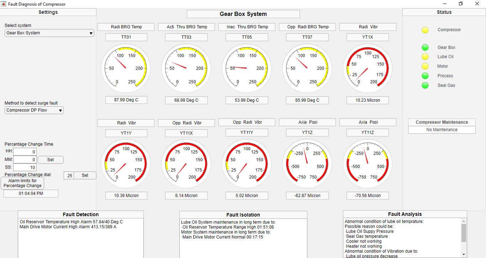

# On-Line Fault Diagnosis and Predictive Maintenance of Single Stage Centrifugal Compressor

## Table of contents

1. [Introduction](#Introduction)
2. [Prerequisites](#Prerequisites)
3. [Features explanation](#Features-explanation)
4. [Setup](#Setup)

## Introduction

This is a Fault Diagnosis and Predictive Maintenance(FDPM) software tool made with MatLab. This software tool provides the main functions you'd expect from an industrial software, such as real-time monitoring, fault diagnosis, fault prediction, adjustable system parameters and LED indicators.

## Prerequisites

List of MatLab toolboxes used

* Statistics and Machine Learning Toolbox
* Fuzzy Logic Toolbox
* GUIDE
* Appdesigner

## Features explanation

## Sources

## Setup

This research project was done in collaboration with Atlas Copco. So, I cannot upload the developed code. You can contact me from the information given below.

## Other information	

* Author: Akash M. Shah (+917622800636) (https://www.linkedin.com/in/akash-m-shah/)
* Guide: Dr. Jagrut J. Gadit (MSU, Vadodara), Mr. Hitendra Patel (Atlas Copco, Vadodara)